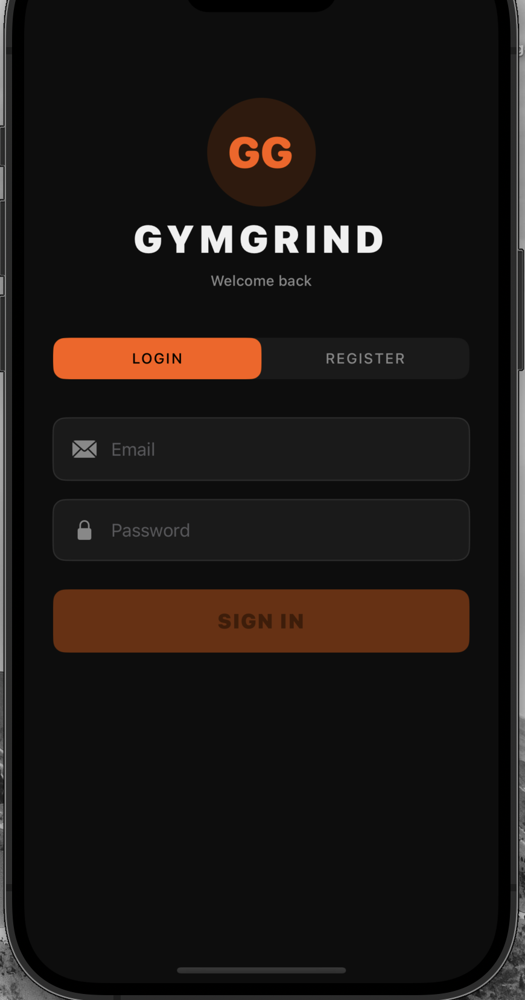
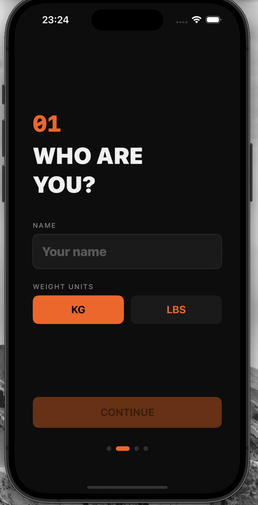
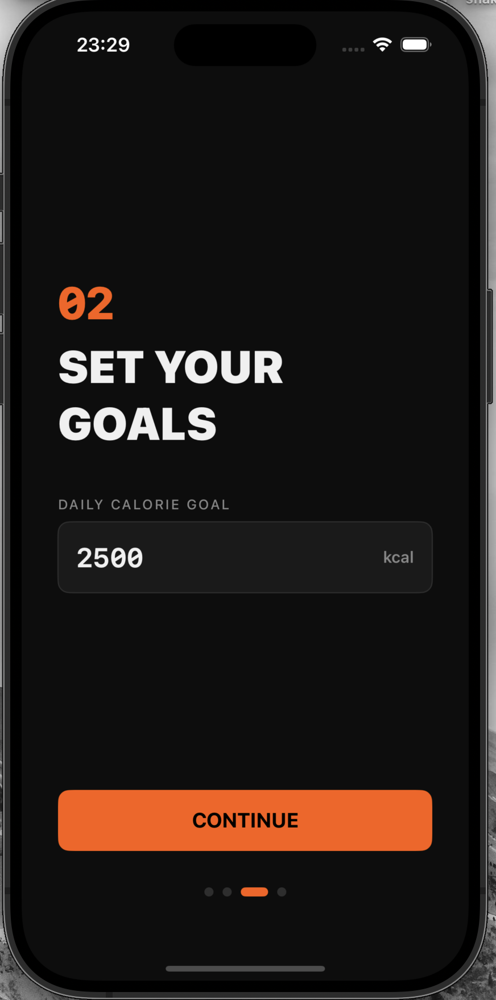
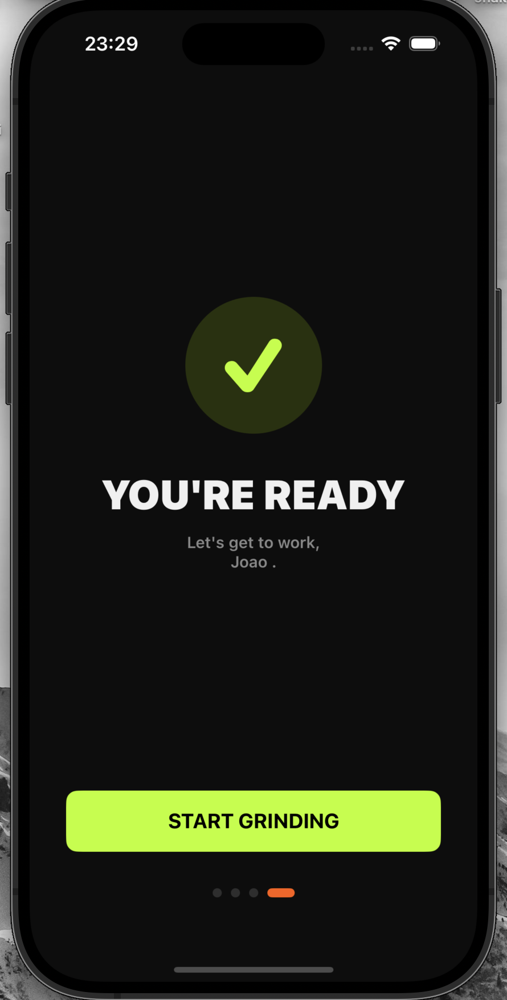
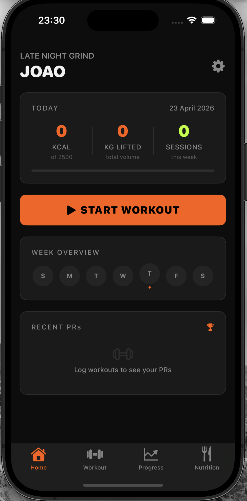
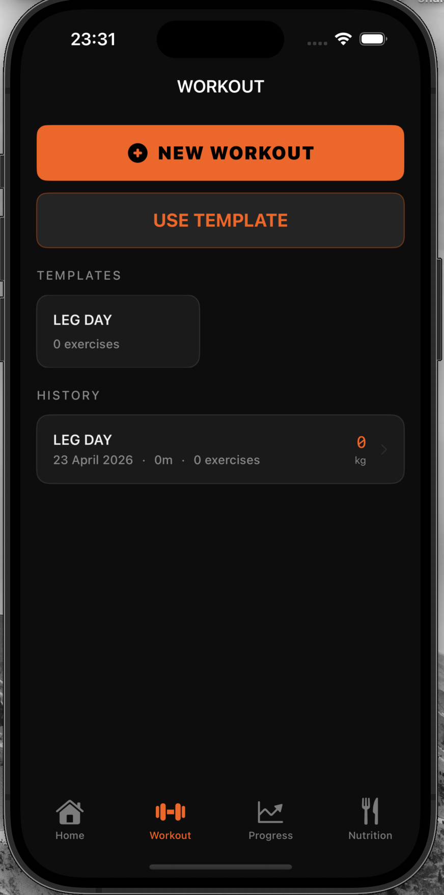
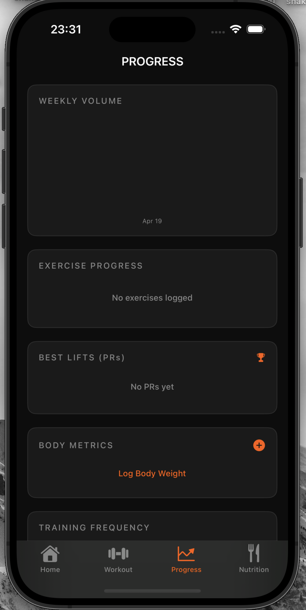
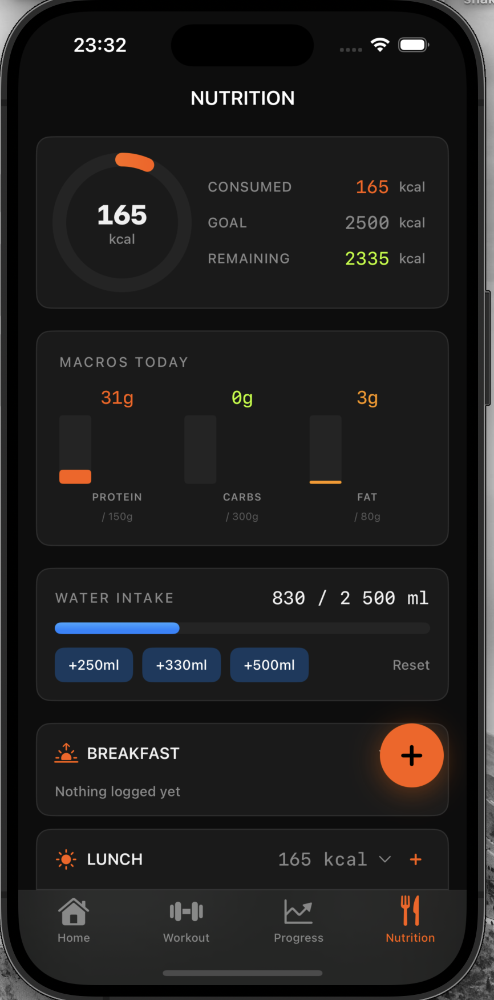
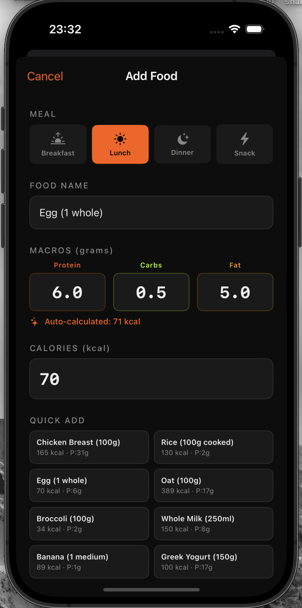

# GymGrind

A native iOS fitness tracking app built with SwiftUI and Supabase. Log workouts, track nutrition, monitor body metrics, and visualise your progress — all synced to the cloud.

---

## Screenshots

| | | |
|---|---|---|
|  |  |  |
| Login | Onboarding — Who are you? | Onboarding — Set your goals |
|  |  |  |
| You're ready | Home Dashboard | Workout |
|  |  |  |
| Progress | Nutrition | Add Food |

---

## Features

- **Authentication** — Email/password sign-up and login via Supabase Auth
- **Onboarding** — First-launch flow to set your name, weight unit, and daily calorie goal
- **Home Dashboard** — Daily summary of calories, volume lifted, and weekly sessions
- **Workout Logging** — Create sessions, add exercises, log sets with weight & reps, auto-detect personal records (PRs)
- **Workout Templates** — Save and reuse workout templates for faster session creation
- **Nutrition Tracking** — Log meals with calories, protein, carbs, and fat; quick-add common foods
- **Body Metrics** — Track weight and body fat percentage over time
- **Progress Charts** — Visualise weekly volume, exercise progress, best lifts (PRs), and body composition trends
- **Cloud Sync** — All data backed up to Supabase; pull everything on a new device after login
- **Settings** — Customise weight unit (kg/lbs) and daily nutrition goals

---

## Tech Stack

### Frontend
| | |
|---|---|
| Language | Swift |
| UI Framework | SwiftUI |
| Local Storage | SwiftData |
| Architecture | MVVM |
| Platform | iOS 17+ |

### Backend & Database
| | |
|---|---|
| Database | Supabase (PostgreSQL) |
| Authentication | Supabase Auth (email/password) |
| Security | Row Level Security (RLS) — each user only accesses their own data |
| API | Supabase REST API via custom HTTP client |

---

## Setup

### Prerequisites

- Xcode 15 or later
- An iOS 17+ simulator or physical device
- A [Supabase](https://supabase.com) account and project

### Step 1 — Clone the repository

```bash
git clone git@github.com:jovbcorreia/GymGrind.git
cd GymGrind
```

### Step 2 — Create a Supabase project

1. Go to [supabase.com](https://supabase.com) and create a new project
2. Go to **Project Settings → API** and copy your **Project URL** and **anon/public key**

### Step 3 — Configure the app credentials

Copy the example secrets file and fill in your Supabase credentials:

```bash
cp GymGrind/Secrets.swift.example GymGrind/Secrets.swift
```

Then open `Secrets.swift` and replace the placeholder values:

```swift
enum Secrets {
    static let supabaseURL     = "https://<your-project-id>.supabase.co"
    static let supabaseAnonKey = "<your-anon-key>"
}
```

> `Secrets.swift` is listed in `.gitignore` and will never be committed.

### Step 4 — Apply the database schema

1. In your Supabase dashboard, open the **SQL Editor**
2. Paste and run the full contents of `supabase_schema.sql`

This creates all tables, enables Row Level Security on each table, and sets up the auto-profile trigger that creates a user profile on sign-up.

### Step 5 — Open in Xcode and run

```bash
open GymGrind.xcodeproj
```

Select an iPhone simulator (iOS 17+) and press **⌘R** to build and run.

---

## Database Schema

| Table | Description |
|-------|-------------|
| `profiles` | User settings and daily goals (linked to `auth.users`) |
| `workout_sessions` | Workout sessions with name, date, and duration |
| `exercise_entries` | Exercises within a session |
| `set_entries` | Individual sets with weight, reps, and PR flag |
| `food_entries` | Meal log entries with macros |
| `body_metrics` | Weight and body fat snapshots |
| `workout_templates` | Reusable exercise lists |

Row Level Security is enabled on all tables — each user can only read and write their own data.

---

## License

MIT License — see [LICENSE](LICENSE) for details.

Created and owned by **João Vilas-Boas Correia** (joaopsn3@gmail.com)
